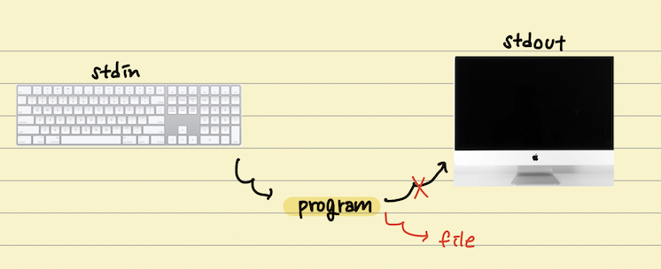

# original_pipe_and_redirect_and_heredoc

# pipe, redirect, here document

## pipe: `|`

- `cmd1 | cmd2`
    - `cmd1`의 표준출력을 `cmd2`의 표준입력으로 받는다.

## redirect: `>`, `<`, `>>`

Linux에서 Input/Output(I/O) redirection은 command를 실행할 때 입력 스트림, 출력 스트림을 재설정하는 기능이다.

> redirect: (다른 주소or방향으로) 다시 전송하다
> 
- `> file` == `1> file`
    
    
    
    - `fd> file`: 출력 스트림을 `fd`에서 `file`로 재설정(redirect)
    - (fd)를 생략하면 표준 출력(standard output: `1`)으로 인식함
        - `> file` == `1> file`
        - `cmd > file` == `cmd 1> file`
    
    ```bash
    ls > file
    # or 
    ls 1> file
    ```
    
    - `ls` 명령어는 해당 디렉토리의 파일들을 list up 하여 표준출력으로 보내는데,
    - `> file`을 했기 때문에, ‘표준출력→file’로 redirect된다.
- `< file` == `0< file`
    
    
    
    - `fd< file`: 입력 스트림을 `fd`에서 `file`로 재설정(redirect)
    - (fd)를 생략하면 표준 입력(standard input: `0`)으로 인식함
        - `< file` == `0< file`
        - `cmd < file` == `cmd 0< file`
    
    ```bash
    < file cat
    # or
    0< file cat
    ```
    
    - `cat` 명령어는 기본적으로 표준입력을 기다리고 입력이 들어오면 해당 내용을 출력해주는데,
    - `< file`을 했기 때문에, ‘표준입력→file’로 redirect된다.
- `>> file` == `1>> file`
    - `> file` 은 output을 file에 내용을 쓴다. (파일이 없으면 생성, 파일이 있으면 내용 덮어쓰기)
    - `>> file`은 output을 file에 내용을 추가한다. (파일이 없으면 생성, 파일이 있으면 기존 내용에 추가)

## here document: `<<`

- `<< 'DELIMITER'`
    - `'DELIMITER'`가 입력으로 들어올 때까지 입력을 넣어주고, `'DELIMITER'`를 입력으로 넣어주면, 그 때까지 넣어준 입력이 입력 스트림으로 들어간다.
    - `'DELIMITER'` 대신 EOF(end of file: `ctrl + d`)로 종료해도 동일하게 처리된다.
    
    ```bash
    << END cat
    test string1
    test string2
    END
    ```
    
    위와 같이 입력하면, 표준출력으로 `test string1`, `test string2`가 출력된다.
    
    ```bash
    << END cat > file
    test string1
    test string2
    END
    ```
    
    위와 같이 입력하면, `test string1`, `test string2`가 `file`에 저장된다.
    

---

# Pipes and Redirects 실습

## Basic Redirects

Start off by creating a file:

```bash
echo "contents of file1" > file1
```

`>` 문자는 redirect 연산자이다. 이것은 일반적으로 터미널에서 볼 수 있는 선행명령의 output(출력)을 가져와 사용자가 제공한 파일로 보낸다. 위 명령을 실행하면, file1 파일에 “contents of file1” 이라는 문자열이 입력된다. 때때로 터미널에 표시되는 모든 출력이 이것으로 리디렉션되는 것은 아니지만 아직 이에 대해 걱정하진 마라.

## Basic Pipes

Now type this in:

```bash
cat file1 | grep -c file
```

일반적으로 파일 이름을 마지막 인자로 사용하여 `grep`을 실행하지만, 여기에선 `|`(파이프 연산자)를 사용하여 `file`의 내용을 `grep` 명령으로 pipe한다.

pipe는 한 명령의 standard output(표준 출력)을 가져와 다른 명령의 입력으로 전달한다. 

아래의 명령을 실행해봐라:

```bash
cat file2 | grep -c file
```

두 줄을 볼 수 있다. 첫 번째는 에러일 것이고, 두번째는 0일 것이다. 0이 보이는 이유에 대해 설명할 것이다.

## Standard Output vs Standard Error

표준 출력 외에 표준 에러 채널도 있다. 존재하지 않는 파일을 `cat` 명령에 전달하면, 터미널에 오류 메시지가 표시된다. 메시지가 파일의 내용과 같아 보이지만, 다른 출력 채널로 전송된다. 이 경우 표준 출력이 아니라 표준 오류이다.

결과적으로 파이프를 통해 `grep` 명령으로 전달되지 않고 `grep`은 출력에서 일치하는 항목이 0인 것으로 계산한다. 터미널을 보고있는 사람에게는 별 차이가 없는 것 같지만, bash에겐 세상 모든게 다르다.

이러한 채널을 참조하는 더 간단한 방법이 있다. 운영 체제에서 각각에 번호가 할당된다.

이들은 번호가 매겨진 file descriptor이며 처음 세 개는 숫자 0, 1, 2에 할당된다.

- 0 is standard input
- 1 is standard output
- 2 is standard error

‘standard output’을 파일로 리디렉션할 때 리디렉션 연산자 `>`를 사용한다. 암시적으로, file descriptor 1을 사용하고 있다.

아래를 입력하면 ‘standard error’인 리디렉션 2의 예를 볼 수 있다.

```bash
command_does_not_exist
command_does_not_exist 2> /dev/null
```

- 위의 1행에는 예상대로 오류가 표시되지만 2행에는 표시되지 않는다.
- 2행에서 file descriptor 2 (standard error)는 `/dev/null` 이라는 파일로 지정된다.

`/dev/null` 파일은 Linux 커널에서 만든 특수파일이다. 데이터를 펌핑할 수 있는 사실상 블랙홀이다. 데이터에 기록된 모든 내용은 흡수되고 무시된다.

일반적으로 볼 수 있는 또다른 리디렉션 연산자는 `2>&1` 이다.

```bash
command_does_not_exist 2>&1
```

이것이 하는 일은 standard error(`2`)의 출력(output)을 명령의 해당 지점에서 가리키는 끝점 standard output으로 보내도록 shell에 지시하는 것이다.

이 때 standard output은 터미널을 가리키므로, standard error도 터미널을 가리킨다. 표준 출력과 표준 에러 모두 어쨌든 터미널을 가리키기 때문에 사용자의 관점에서 보면 차이가 없다.

그러나 표준 오류 또는 표준 출력을 파일로 리디렉션하려고 하면, 이동 위치를 변경할 수 있기 때문에 상황이 흥미로워진다. 위에서 표준 오류를 `/dev/null`로 리디렉션할 때 이를 보았다.

이제 이것을 입력하고 왜 다른 출력을 생성하는지 알아내라.

```bash
command_does_not_exist 2>&1 > outfile
cat outfile
command_does_not_exist > outfile 2>&1
cat outfile
```

여기서 까다로워지므로 신중히 생각해야 한다.

- 1행은 오류를 출력으로 표시하고 리디렉션된 `outfile`에 아무것도 넣지 않은 반면
- 3행은 오류를 표시하지 않고 `outfile`에 캡처했다.

리디렉션 연산자 `2>&1`은 표준 출력(file descriptor 1)이 그 당시 가리켰던 모든 표준 오류(file descriptor 2)를 가리킨다는 것을 기억해라.

첫 번째 줄을 잘 읽어보면, `2>&1` 지점에서 표준 출력은 터미널을 가리켰다. 따라서 표준 오류는 거기에서 터미널을 가리킨다.

그 시점 이후에는, 표준 출력이 `outfile` 파일로 리디렉션된다 (`>` 연산자 사용). 

그래서 이 모든 것의 끝에:

- `command_does_not_exist` 명령의 출력의 표준 오류는 터미널을 가리킨다.
- 표준 출력은 `outfile` 파일을 가리킨다.

세 번째 줄(`command_dose_not_exist > outfile 2>&1`)에서는 무엇이 다른가?

리디렉션 순서가 변경된다.

- `command_does_not_exist` 명령의 표준 출력은 `outfile` 파일을 가리킨다.
- 리디렉션 연산자 `2>&1`은 file descriptor 1(표준 출력)이 가리키는 모든 것에 file descriptor 2(표준 오류)를 가리킨다.

따라서 실제로, 표준 출력과 표준 오류 모두 동일한 파일(`outfile`)을 가리킨다.

모든 출력을 단일 파일로 보내는 이러한 패턴은 매우 자주 볼 수 있으며, 왜 그 순서가 되어야 하는지 이해하는 사람은 거의 없다. 한번 이해하면, 연산자가 다시 가야할 방향에 대해 생각하기 위해 멈추지 않을 것이다.

## Differences Between Pipes and Redirects

요약:

- pipe는 표준 출력을 다른 명령에 대한 표준 입력으로 전달한다.
- redirect는 출력 채널을 파일로 보낸다.

일반적으로 사용되는 몇 가지 다른 연산자는 여기에 언급할 가치(worth)가 있다:

```bash
grep -c file < file1
```

`<` 연산자는 표준 입력을 `file1` 파일에서 `grep` 명령으로 리디렉션한다. 이 경우, 이전에 본 `cat file | grep -c file`과 동일한 명령이다.

```bash
echo line1 > file3
cat file3
echo line2 > file3
cat file3
echo line3 >> file3
cat file3
```

- 위의 1행과 3행은 `>` 연산자를 사용하는 반면,
- 5행은 `>>` 연산자를 사용한다.

`>` 연산자는 파일이 이미 존재하는지 여부에 관계없이 파일을 효과적으로 새로 만든다. 반대로 `>>` 연산자는 파일 끝에 추가한다.

결과적으로 `line2`와 `line3`만 `file3`에 추가된다.

---

# 참고

[[Pipex] redirection, here document 이해하기](https://velog.io/@kyj93790/Pipex-redirection-here-document-%EC%9D%B4%ED%95%B4%ED%95%98%EA%B8%B0)

[[42서울 / pipex] 리다이렉션과 파이프](https://velog.io/@tmdgks2222/42seoul-pipex)

[Pipes and Redirects - Master the Bash Shell](https://www.educative.io/courses/master-the-bash-shell/3w5GrpYLENn)