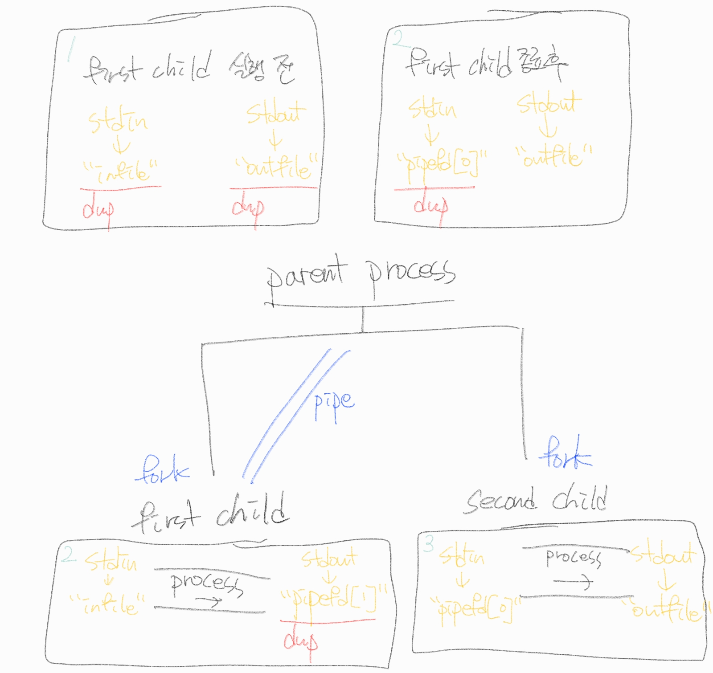

# pseudo

- A 프로그램에서 B 프로그램을 실행하기 위해서는 `fork()` + `exec()`계열함수를 연속으로 호출하여 실행해야 한다. `fork()`는 자신과 같은 프로세스(A 프로그램)를 생성하고, `exec()`계열함수는 프로세스의 내용을 B 프로그램으로 교체한다.

---

# Mandatory part

1. parent process의 표준 입력 스트림과 표준 출력 스트림을 redirection한다. (각각 `infile`, `outfile`로 redirection)
2. 첫 명령어를 실행하고, 명령어의 출력을 `pipe`의 buffer에 저장한다.
    1. `pipe` 생성 (chlid process → parent process 로 데이터를 전달하는 역할)
    2. `fork`
        1. first child process
            1. 표준 출력 스트림을 `pipe`로 redirection.
            2. execute command. (read from `infile`, write to `pipe`)
            3. terminate.
        2. parent process
            1. wait for the first child process to terminate.
            2. 표준 입력 스트림을 `pipe`로 redirection → 두 번째 명령에서 표준 입력 스트림을 이용해 `pipe`의 buffer를 읽을 수 있다.
3. `pipe`의 buffer에서 입력을 받아 두 번째 명령어를 실행한다.
    1. `fork`
        1. second child process
            1. execute command. (read from `pipe`, write to `outfile`)
            2. terminate.
        2. parent process
            1. wait for the second child process to terminate.

---

# Bonus part

1. 첫 인자가 `here_doc` 인지 확인한다.
    1. `here_doc`인 경우 → `<<` and `>>` 처리 (here document and appending redirection)
        1. 표준 입력을 임시 파일 `.heredoc_tmp`에 입력한다.
            1. write mode로 `.heredoc_tmp`를 오픈한다.
            2. 터미널 창에서 표준 입력을 받아 `.heredoc_tmp`에 출력한다.
                1. 반복: 표준 입력이 `limiter`와 같을 때 까지 반복
                    1. 터미널에 `heredoc>`  를 띄운다.
                    2. 표준 입력을 받아 문자열로 저장한다.
                    3. 입력받은 문자열이 `limiter`와 같은지 검사한다.
                        1. 같으면 `break`
                    4. 입력받은 문자열을 `.heredoc_tmp`에 출력한다.
            3. `.heredoc_tmp`를 닫는다.
        2. parent process의 표준 입력 스트림과 표준 출력 스트림을 redirection한다. (각각 `.heredoc_tmp`, `outfile`로 redirection)
            1. `outfile`은 `O_APPEND` 플래그로 연다. (`>>` 처리를 위함)
            2. `.heredoc_tmp`는 `unlink`를 해준다. (프로세스 종료 시점에 임시 파일 삭제를 위함)
        3. 반복: 1번 ~ (n -1)번 명령어를 순서대로 실행하고, 각 명령어 실행마다 `pipe`를 만들어서 명령어의 출력을 `pipe`의 buffer에 저장한다.
            1. `pipe` 생성 (chlid process → parent process 로 데이터를 전달하는 역할)
            2. `fork`
                1. first child process
                    1. 표준 출력 스트림을 `pipe`로 redirection.
                    2. execute command. (read from `infile`, write to `pipe`)
                    3. terminate.
                2. parent process
                    1. wait for the first child process to terminate.
                    2. 표준 입력 스트림을 `pipe`로 redirection → 두 번째 명령에서 표준 입력 스트림을 이용해 `pipe`의 buffer를 읽을 수 있다.
        4. 마지막 `pipe`의 buffer에서 입력을 받아 마지막 명령어를 실행한다.
    2. `here_doc`이 아닌 경우 → 다중 파이프 처리
        1. parent process의 표준 입력 스트림과 표준 출력 스트림을 redirection한다. (각각 `infile`, `outfile`로 redirection)
        2. 반복: 1번 ~ (n -1)번 명령어를 순서대로 실행하고, 각 명령어 실행마다 `pipe`를 만들어서 명령어의 출력을 `pipe`의 buffer에 저장한다.
            1. `pipe` 생성 (chlid process → parent process 로 데이터를 전달하는 역할)
            2. `fork`
                1. first child process
                    1. 표준 출력 스트림을 `pipe`로 redirection.
                    2. execute command. (read from `infile`, write to `pipe`)
                    3. terminate.
                2. parent process
                    1. wait for the first child process to terminate.
                    2. 표준 입력 스트림을 `pipe`로 redirection → 두 번째 명령에서 표준 입력 스트림을 이용해 `pipe`의 buffer를 읽을 수 있다.
        3. 마지막 `pipe`의 buffer에서 입력을 받아 마지막 명령어를 실행한다.

---

# 참고

[fork(2) - 프로세스의 생성](http://it-note.kr/160)

[[Pipex] 아키텍쳐 구상](https://velog.io/@kyj93790/Pipex-%EC%95%84%ED%82%A4%ED%85%8D%EC%B3%90-%EA%B5%AC%EC%83%81)